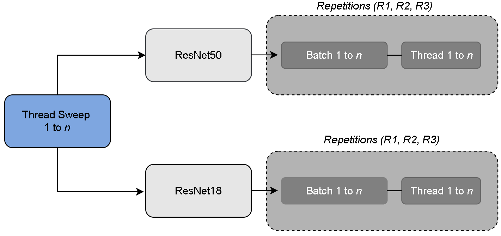

# GDEV-AI: A Generalized Evaluation of Deep Learning Inference Scaling and Architectural Saturation
[](https://arxiv.org/abs/2602.16858)

## 📄 Paper
Official artifact accompanying the arXiv preprint:
**GDEV-AI: A Generalized Evaluation of Deep Learning Inference Scaling and Architectural Saturation**

Available on arXiv: https://arxiv.org/abs/2602.16858

# gdev-ai-cpu-inference-benchmark

This repository provides the exact CPU-only benchmarking script used to
generate the inference scaling results reported in the paper.



------------------------------------------------------------------------

# 1. Overview

This benchmark quantifies:

-   Throughput scaling (images/sec)
-   Median latency
-   P99 tail latency
-   Thread-level saturation behavior
-   Oversubscription effects
-   Batch-size tradeoffs

The goal is to establish a reproducible CPU inference baseline under
modern deep learning workloads.

------------------------------------------------------------------------

# 2. Models Evaluated

-   ResNet-18
-   ResNet-50

All measurements are performed using:

-   PyTorch (Eager mode)
-   CPU-only execution
-   No CUDA
-   No quantization
-   No TorchScript
-   No TensorRT

------------------------------------------------------------------------

# 3. System Requirements

## Operating System

Linux (Ubuntu 22.04 recommended)

## Python

Python 3.8+

------------------------------------------------------------------------

# 4. Installation

Create and activate a virtual environment:

``` bash
python3 -m venv gdevai_env
source gdevai_env/bin/activate
```

Install dependencies:

``` bash
pip install --upgrade pip
pip install torch torchvision --index-url https://download.pytorch.org/whl/cpu
pip install numpy
```

Verify installation:

``` bash
python -c "import torch; print(torch.__version__)"
```

------------------------------------------------------------------------

# 5. Benchmark Configuration (Paper Settings)

To reproduce the paper exactly:

-   Warmup iterations: 20
-   Timed iterations: 100
-   Batch sizes: 1, 2, 4, 8, 16

Thread sweeps:

Legacy platform: 1, 2, 3, 4

Modern platform: 1, 2, 3, 4, 6, 8, 12, 16, 24, 32, 40, 48

Additional configuration: torch.set_num_interop_threads(1)

Pretrained ImageNet weights are used.

------------------------------------------------------------------------

# 6. Running the Benchmark

## Basic Run

``` bash
python run_cpu_inference_benchmark.py
```

## Recommended: Core Pinning (Modern Systems)

To reduce scheduling noise and to match the results reported in the preprint, run the benchmark with core pinning. For a system with $N$ physical cores and to avoids hyperthread scheduling interference.

Example for a 24-core system:

``` bash
taskset -c 0-23 python run_cpu_inference_benchmark.py
```

------------------------------------------------------------------------

# 7. Server-Specific Thread Configuration

The benchmark script supports two thread sweep configurations. Only one
configuration should be enabled at a time inside the script.

## Legacy Server Configuration

Uncomment the following and comment out the modern configuration:

``` python
# Legacy server setting
TMAX = int(sysinfo["cpu_logical_cpus"]) if sysinfo["cpu_logical_cpus"] else 4
THREADS_LIST = list(range(1, TMAX + 1))
```

This performs a full sweep from 1 up to the maximum logical CPUs. Use
this for older or low-core-count systems.

## Modern Server Configuration

Comment out the legacy configuration and enable:

``` python
# Modern server setting
logical_cpus = int(sysinfo["cpu_logical_cpus"]) if sysinfo["cpu_logical_cpus"] else 1
THREADS_LIST = [t for t in [1, 2, 3, 4, 6, 8, 12, 16, 24, 32, 40, 48] if t <= logical_cpus]
```

This controlled sweep matches the configuration used in the paper and
avoids excessive noisy oversubscription on high-core systems.

------------------------------------------------------------------------

# 8. Output

Results are written to:

benchmark_results_final.csv

Each row contains:

-   Timestamp
-   Model
-   Batch size
-   Thread count
-   Median latency (ms)
-   P99 latency (ms)
-   Throughput (images/sec)
-   System metadata (CPU, memory, OS, PyTorch version)

------------------------------------------------------------------------


